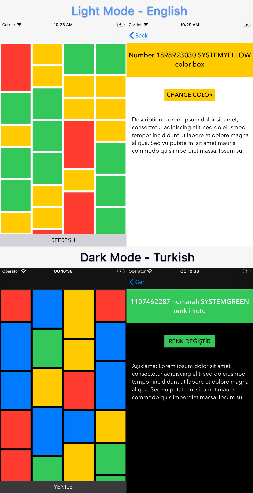

# Random Colors Application  

Purpose of the project
======================

This is the Tekna IT job applying project which has a list of random colors and numbers of boxes.

Here are the screens
======================

&nbsp; 
    

## Tech-stack :calling:

* [MVC](https://www.raywenderlich.com/1000705-model-view-controller-mvc-in-ios-a-modern-approach)

* [Swift 5](https://github.com/apple/swift)

Find this repo useful?
======================

Find this repo useful? :heart: 

Support it by joining [stargazers](https://github.com/emrdgrmnci/RandomColors/stargazers) for this repository. :star:

